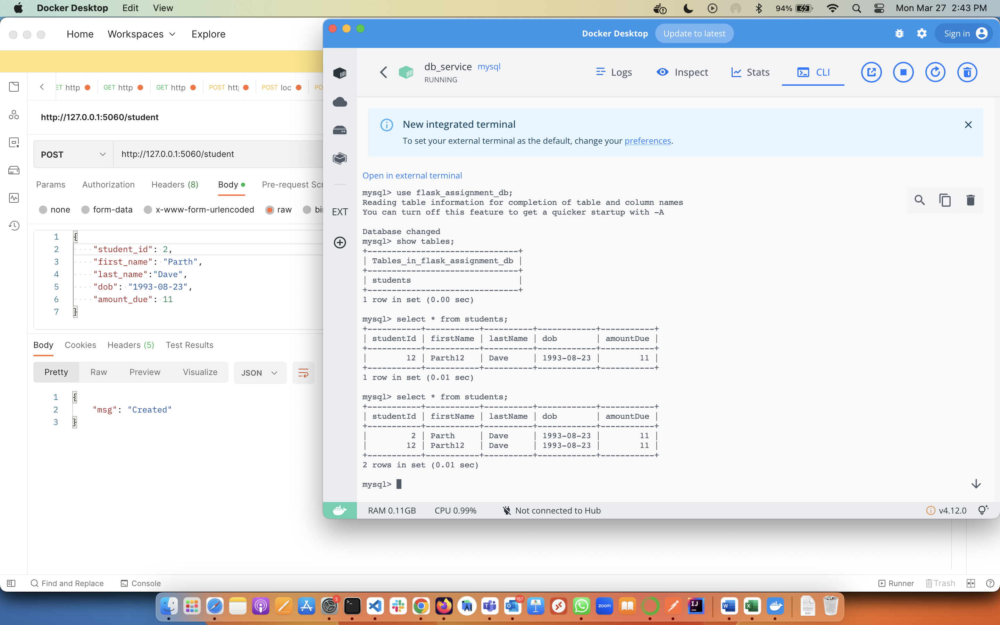
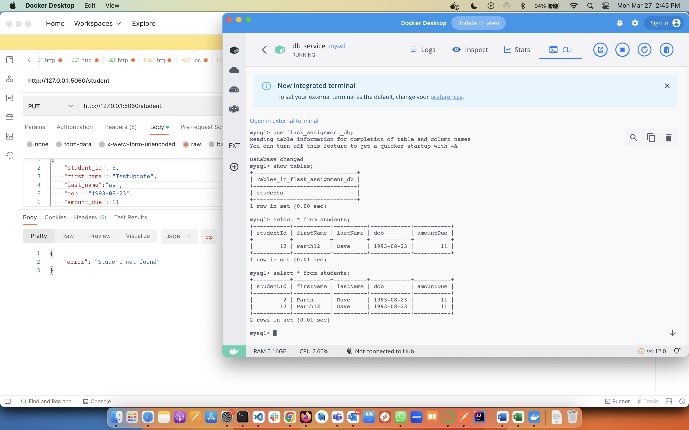
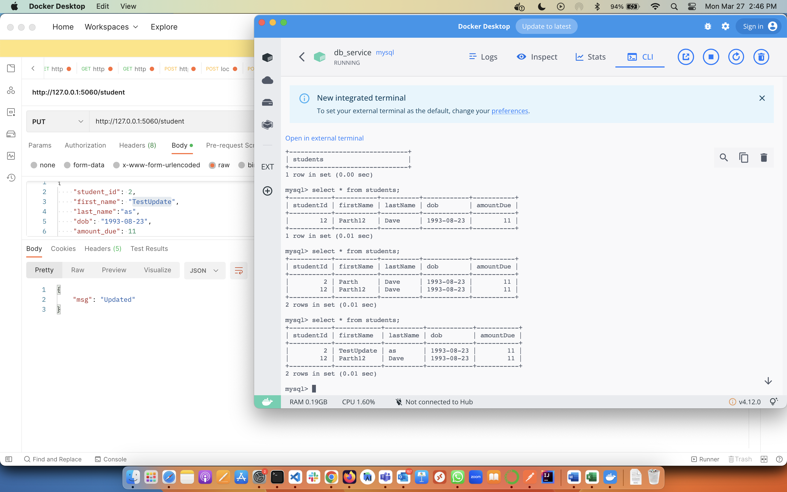
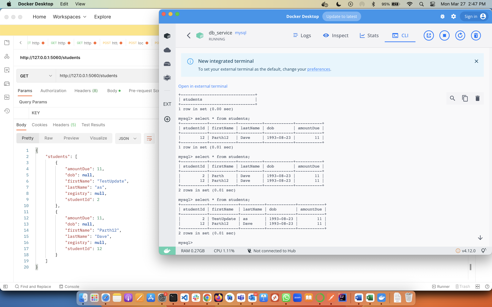
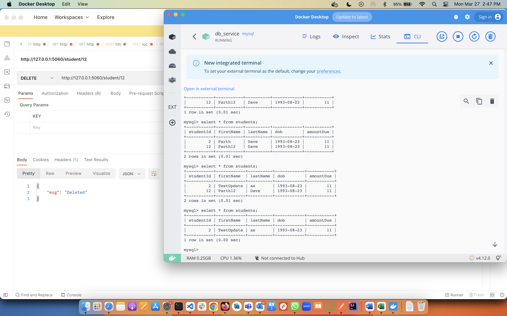
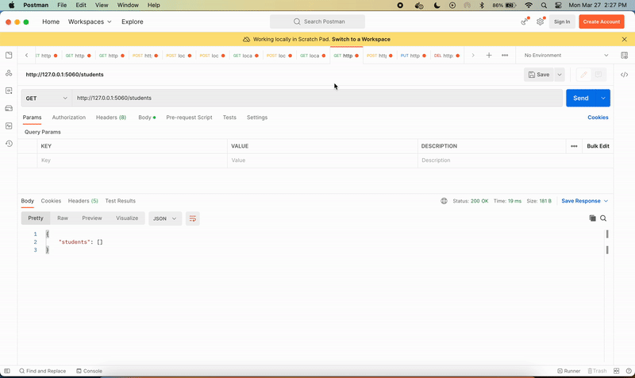
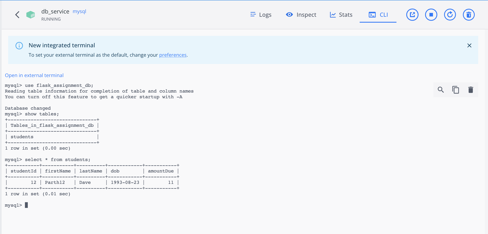

# Assignment

This is an assignment showcasing the flask api integration in python.

# Points that covered
1. Created docker container to install python and mysql
2. Connected python flask api and mysql
3. Created CRUD intigration in mysql for flask
4. Created video to demostrate the functionality for this assignment
5. Showcased docker cli commands to showcase the result after demo

# Evidence

## Create Record


## Update Record
### Update Record not found


### Update Record


## Fetch All


## Delete Student


## Demo




### Source code info
Here is a mysql image that will be added inside db service.<br/>
I have set container name as `db_service` to identify and connect db from flask api.<br/>
added evironment variables so that db gets initialised and user and password will be set.<br/>
also added `create-database.sql` inside database_schema to create table when database gets initialised.<br/>

[Docker compose file](./docker-compose.yml)
````docker
db:
    image: mysql
    restart: always
    container_name: db_service
    command: --default-authentication-plugin=mysql_native_password
    environment:
      - "MYSQL_DATABASE=flask_assignment_db"
      - "MYSQL_USER=root_1"
      - "MYSQL_PASSWORD=root_1"
      - "MYSQL_ROOT_PASSWORD=root_1"
    volumes:
      - ./database_schema:/docker-entrypoint-initdb.d
    ports:
      - "3306:3306"
````

After setting up docker database service I have set backend image which will depend on db service
```docker
flask-backend:
    container_name: "flask-backend"
    build:
      context: .
      dockerfile: Dockerfile
    image: "flask-backend"
    ports:
      - "5060:5060"
    stdin_open: true
    restart: always
    depends_on:
      - db
    links:
      - db
```

[Docker file](./Dockerfile) has all commands to install via pip install.
```docker
FROM python:3.7
ENV FLASK_APP=app

LABEL version="1.0.0"
LABEL description="This is Flask api assignment project"
LABEL maintainer = ["parthdave.work@gmail.com"]

# Set working directory

WORKDIR /usr/src/flask-backend

RUN pip3 install pipenv
RUN pip3 install flask
RUN pip3 install flask-cors
RUN pip3 install flask-mysql
RUN pip3 install mysql-connector-python
RUN pip3 install sqlalchemy
RUN pip3 install psycopg2

COPY . .

# RUN flask --app api_v1 run -p 5060
CMD ["python3","-m","flask","run","--host=0.0.0.0","-p 5060"]
EXPOSE 5060
EXPOSE 3306
# RUN pipenv run python api/app_v1.py
```

After setting up docker and all things I have created [app.py](./app.py) file
```python
@app.route('/student', methods=['POST'])
def createStudent():
    content = request.json
    if content["student_id"] is None:
        return jsonify({"error": "Student id is required"})
    student = StudentRecord(content["student_id"], content["first_name"],
                            content["last_name"], content["dob"], content["amount_due"])

    response = make_response(
        jsonify(Repository().createStudentRecord(student)), 201)
    response.headers['Content-Type'] = 'application/json'
    return response
```

In above code I have created a post api for student and I am sending all data to [repository](./api/repository.py) which will call createStudentRecord function.
```python
def createStudentRecord(self, student):
        if self.database.create(student):
            return {"msg": "Created"}
        return {"error": "Error creating student record!"}
```

We will navigate call to [database class](./api/database.py)
```python
class Database():
    def __init__(self) -> None:
        self.session = self.connectDB()

    def connectDB(self):
        engine = create_engine(
            "mysql+pymysql://root_1:root_1@db_service/flask_assignment_db")
        return Session(bind=engine)

    def create(self, obj):
        self.session.add(obj)
        self.session.commit()
        return True
    

    def updateStudentRecord(self, student):
        studentRecord = self.database.fetchStudent(student.studentId)
        if studentRecord is None:
            return {"error": "Student not found"}
        else:
            if self.database.update(student):
                return {"msg": "Updated"}
            return {"error": "Error updating student record!"}
```

This concludes the code to have CRUD operations via Flask.